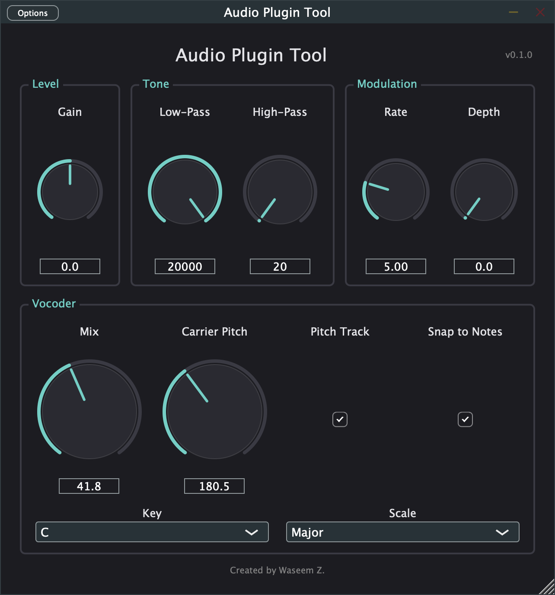

# Audio Plugin Tool

A real-time audio effects plugin built with C++20 and [JUCE](https://juce.com/), featuring gain control, low-pass/high-pass filtering, tremolo, a pitch-tracking vocoder, and soft-clipping protection. Ships as both a **VST3 plugin** and a **standalone application**, with an automated test suite spanning C++ unit tests and Python-based acoustic/DSP verification.



## Features

- **Gain** (-24 dB to +24 dB) with smoothed parameter ramping to avoid zipper noise
- **Low-pass and high-pass filters** (20 Hz - 20 kHz, TPT state-variable design)
- **Tremolo** — sine-LFO amplitude modulation (0.1-20 Hz rate, 0-100% depth)
- **Vocoder** — a 16-band filter-bank vocoder with a dual-sawtooth carrier, real-time autocorrelation pitch tracking (the carrier follows whatever note you sing), and musical-key-aware note quantization (Auto-Tune-style snapping, restricted to the notes in a selected Key/Scale)
- **Soft-clipping protection** — a `tanh()`-based limiter that makes it mathematically impossible for the output to exceed 0 dBFS, no matter how the other stages are set
- **VST3 + Standalone** builds from a single CMake configuration
- **Custom GUI** with a dark theme and hand-drawn rotary knobs (not JUCE's default look)

## Architecture

The signal chain is a `juce::dsp::ProcessorChain`, run once per audio block in `AudioProcessor::processBlock`:

```
Input → Gain → Vocoder → Low-Pass Filter → High-Pass Filter → Tremolo → Clipper → Output
```

Every stage exposes its parameters through a single `juce::AudioProcessorValueTreeState`, which is what makes the parameters simultaneously:
- host-automatable (for the VST3 build),
- safely shared between the GUI thread and the real-time audio thread (via `std::atomic`), and
- state-savable (recalled when a DAW project reloads).

The GUI (`PluginEditor`) never touches audio directly — it only reads/writes parameters through `SliderAttachment`s, keeping the real-time audio thread fully decoupled from the message thread, as JUCE's architecture requires.

`Tremolo`, `Clipper`, and `Vocoder` are hand-written classes (`Source/DSP/`) that satisfy `ProcessorChain`'s expected interface (`prepare` / `reset` / `process`) via templates, so they slot in next to JUCE's built-in `Gain` and `StateVariableTPTFilter` without inheriting from anything.

### Vocoder

`Vocoder` splits the input into 16 frequency bands (`juce::dsp::IIR` bandpass filters), tracks each band's loudness with an attack/release envelope follower, and imposes that envelope onto an internally generated carrier (two slightly detuned sawtooth oscillators, summed per band). A separate `PitchTracker` (`Source/DSP/PitchTracker.h`) estimates the input's fundamental frequency via autocorrelation — sliding the waveform against a delayed copy of itself and finding the lag with the strongest self-similarity — and retunes the carrier to match, so the vocoder sings whatever note is sung into it. When note-snap is enabled, the tracked pitch is quantized to the nearest note in the selected musical Key/Scale before being applied to the carrier.

## Project structure

```
AudioPluginTool/
├── CMakeLists.txt
├── JUCE/                       # JUCE framework (git submodule)
├── Source/
│   ├── PluginProcessor.h/.cpp  # Audio engine: parameters + DSP chain
│   ├── PluginEditor.h/.cpp     # GUI: knobs, layout, parameter attachments
│   ├── DSP/
│   │   ├── Tremolo.h           # Sine-LFO amplitude modulation
│   │   ├── Clipper.h           # tanh() soft-clipping safety stage
│   │   ├── Vocoder.h           # 16-band filter-bank vocoder + note quantization
│   │   └── PitchTracker.h      # Autocorrelation-based pitch detection
│   ├── GUI/
│   │   └── PluginLookAndFeel.h/.cpp  # Dark theme + custom rotary knob drawing
│   ├── RenderHarness/
│   │   └── Main.cpp            # Headless CLI tool: renders test signals to WAV
│   └── Tests/                  # C++ unit tests (JUCE UnitTest framework)
├── tests/                      # Python test suite (pytest)
│   ├── render_harness.py       # Wraps RenderHarness via subprocess
│   ├── dsp_analysis.py         # Shared FFT/magnitude-response helpers
│   ├── test_filter_response.py
│   ├── test_clipping.py
│   ├── test_latency.py
│   ├── test_output_consistency.py
│   ├── test_parametrized_behavior.py
│   ├── test_vocoder.py
│   └── requirements.txt
└── docs/screenshots/
```

## Building from source

### Prerequisites

- macOS with Xcode Command Line Tools (`xcode-select --install`)
- [CMake](https://cmake.org/) ≥ 3.22
- [Ninja](https://ninja-build.org/) (`brew install ninja`)
- Python 3.10+ (only needed to run the Python test suite)

### Clone and build

```bash
git clone --recurse-submodules https://github.com/<your-username>/AudioPluginTool.git
cd AudioPluginTool

cmake -B build -G Ninja
cmake --build build
```

This produces:
- `build/AudioPluginTool_artefacts/Standalone/Audio Plugin Tool.app` — run it directly
- `build/AudioPluginTool_artefacts/VST3/Audio Plugin Tool.vst3` — auto-installed to `~/Library/Audio/Plug-Ins/VST3/`, loadable in any VST3 host

> If you already cloned without `--recurse-submodules`, run `git submodule update --init` to fetch JUCE.

## Running the tests

**C++ unit tests** (parameter layout, DSP math in isolation, edge cases):

```bash
cmake --build build --target UnitTests
./build/UnitTests
# or: ctest --test-dir build --output-on-failure
```

**Python acoustic tests** (filter frequency response, clipping behavior, latency, output determinism — measured by rendering real audio through the compiled plugin and analyzing it with FFT/numpy):

```bash
cmake --build build --target RenderHarness
python3 -m venv .venv && source .venv/bin/activate
pip install -r tests/requirements.txt
cd tests && python3 -m pytest -v
```

The Python tests work by driving `RenderHarness` — a small headless executable that loads the plugin's `AudioProcessor` directly (no host, no GUI), feeds it known signals (white noise, an impulse, on/off "bursts", or a sustained tone), and writes the result to a WAV file for analysis. This lets the test suite verify actual DSP behavior rather than just checking that the code runs — e.g. "does the low-pass filter really attenuate frequencies above its cutoff by at least 12 dB?", "does the vocoder's output loudness actually track a bursty on/off input, or does it just hum constantly?", "does note-snap actually quantize a slightly-flat 225 Hz tone to a perfect 220 Hz (A3)?", "does selecting a different musical Key change which notes count as in-tune?"

## License

MIT — see [LICENSE](LICENSE).
